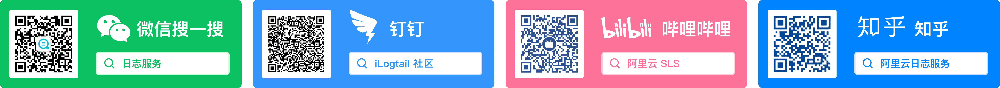

# What is iLogtail

.png>)

iLogtail was born for observable scenarios and has many production-level features such as lightweight, high performance, and automated configuration, which are widely used internally by Alibaba Group and tens of thousands of external Alibaba Cloud customers. You can deploy it in physical machines, Kubernetes and other environments to collect telemetry data, such as logs, traces and metrics.

  

## Advantages

The core advantages of **iLogtail** :

* Support a variety of Logs, Traces, Metrics data collection, and friendly to container and Kubernetes environment support.
* The resource cost of data collection is quite low, 5-20 times better than similar telemetry data collection Agent performance.
* High stability, used in the production of Alibaba and tens of thousands of Alibaba Cloud customers, and collecting dozens of petabytes of observable data every day with nearly tens of millions deployments.
* Support plugin expansion, such as collection, processing, aggregation, and sending modules.
* Support configuration remote management and provide a variety of ways, such as SLS console, SDK, K8s Operator, etc.
* Supports multiple advanced features such as self-monitoring, flow control, resource control, alarms, and statistics collection.

## Features

**iLogtail** supports the collection of a variety of telemetry data and transmission to a variety of different backends, such as [SLS observable platform](https://www.aliyun.com/product/sls). The data supported for collection are mainly as follows:

* Logs
  * Collect static log files
  * Dynamic collect the files when running with containerized environment
  * Dynamic collect Stdout when running with containerized environment
* Traces
  * OpenTelemetry protocol
  * Skywalking V2 protocol
  * Skywalking V3 protocol
  * ...
* Metrics
  * Node metrics
  * Process metrics
  * Gpu metrics
  * Nginx metrics
  * Support fetch prometheus metrics
  * Support transfer telegraf metrics
  * ...

## Contact Us

You can report bugs, make suggestions or participate in discussions through [Github Issues](https://github.com/alibaba/ilogtail/issues), or contact us with the following ways:

* DingTalk：iLogtail社区
* WeChat：日志服务
* Bilibili：[阿里云SLS](https://space.bilibili.com/630680534?from=search\&seid=2845737427240690794\&spm\_id\_from=333.337.0.0)
* Zhihu：[阿里云日志服务](https://www.zhihu.com/people/a-li-yun-ri-zhi-fu-wu)

